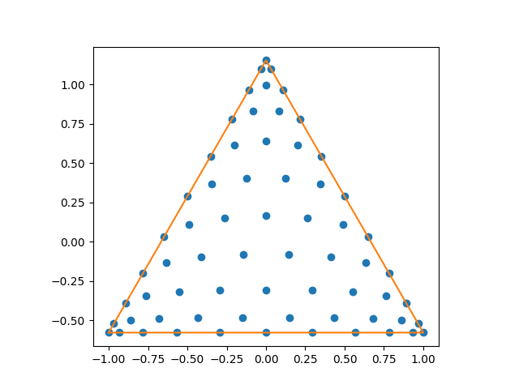
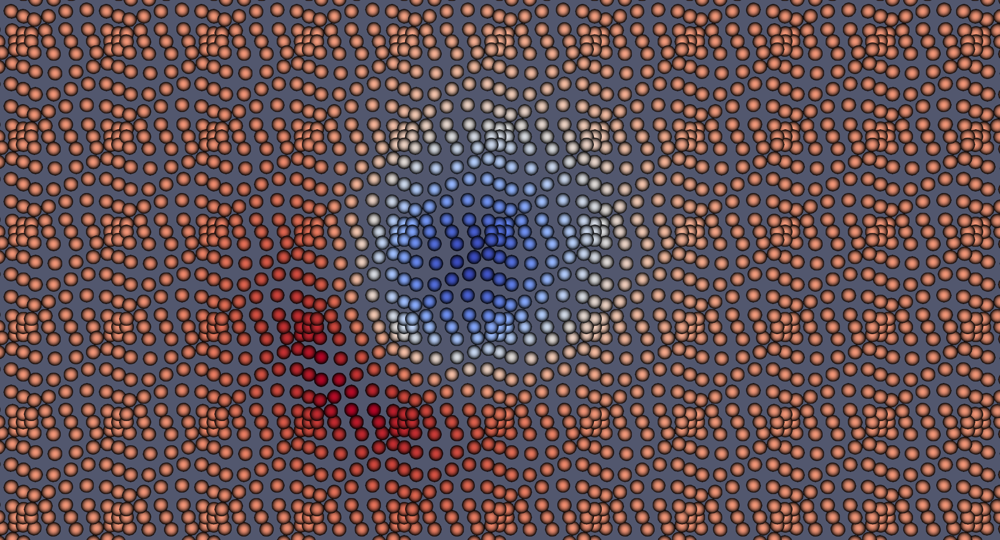
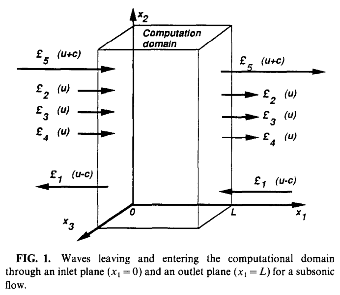

#   Discretization

* [Slides](./slides/1-discrete.pdf)

---

- Compare and critique meshing and discretization schemes.
- Identify common modes of numerical error.
- Produce a mesh suitable for use in MIRGE-Com simulations.

Most numerical simulations require the modeled system to be broken into discrete components along a grid so that individual points and fields can be calculated and interpolated to produce an overall system state.  Let's look at how MIRGE-Com handles the problem discretization and represents the grid.

The basic algorithm for a numerical solution is as follows:

1. Accept a mesh (generated from a geometry) and populate it into elements with specified connectivity.
2. Decompose the elements into structures and write a governing equation relationship (such as heat transfer, mass transfer, momentum transfer, force-displacement) for each element.
3. Assemble all of the elements to get the governing equation statement for the entire problem, if explicily formulatedt; set up an iterative loop, if implicitly formulated.
4. Apply boundary conditions.
5. Solve the resulting linear system to get the solution.
6. Post-process this result to extract temperature, heat flux, velocity, and other variables of interest.


##  Geometry & Mesh

MIRGE-Com specifies problem geometry using the `meshmode.mesh.generation` module.  There are a number of 2D and 3D volumetric primitives such as `generate_regular_rect_mesh` and `make_curve_mesh` which can be used to compose a mesh.

```py
from meshmode.mesh.generation import generate_regular_rect_mesh
mesh = generate_regular_rect_mesh(
    a=(-0.5,-0.5),
    b=( 0.5, 0.5),
    n=(nel_1d, nel_1d))
```

MIRGE-Com can also import an existing mesh file:

```py
from meshmode.mesh.io import read_gmsh
meshfile = "./isolator.msh"
mesh = read_gmsh(meshfile, force_ambient_dim=2)
```

In a typical model, the geometry is used to produce a mesh, which is then filled with appropriate cells per the mathematical being used.

**Geometry**.  Geometry files `.geo` define the boundary points in 2D or 3D.  The geometry typically specifies boundaries (and perhaps voids), sometimes materials.

- Examine [`isolator.geo`](https://raw.githubusercontent.com/w-hagen/isolator/master/isolator.geo).

**Mesh**.  Mesh files `.msh` can be produced using CAD programs, [Gmsh](https://gmsh.info/doc/texinfo/gmsh.html), and other programs.  The mesh specify edge points for elements to span between, but does not specify the nature of those elements.

Two-dimensional elements are typically triangular or quadrilateral.  Triangles are good for complex geometries, but there are mixed opinions on whether quadrilaterals are all-round superior.

> Quadrilateral plane stress finite elements ... possess more nodes and dof than comparable triangular elements and therefore require shape functions of higher polynomial degree.  This allows more variation of strain and stress within the element with the consequent opportunities for better accuracy.  (Carroll)

Three-dimensional elements are tetrahedra or “hexahedra” (a funny way of saying blocks).

- Use Gmsh to produce a 2D mesh for `isolator.msh` from `isolator.geo`.

In many cases, our domain is separated across an array of processors.  Such distributed computing introduces new considerations in mesh layout and partition; we will cover this in more detail in “Grid Data Structures.”

- [Carroll, *A Primer for Finite Elements in Elastic Structures*](https://books.google.com/books?id=6J7ec7ILGYQC&pg=PA225&lpg=PA225#v=onepage&q&f=false).
- [FEM for Two-Dimensional Solids (Finite Element Method) Part 1](http://what-when-how.com/the-finite-element-method/fem-for-two-dimensional-solids-finite-element-method-part-1/)


##  Elements

Given a mesh of elements, we must select a numerical method which converges on an approximately correct solution.  Depending on the simulation, we can choose finite difference methods, finite element methods, and finite volume methods, among others.

MIRGE-Com implements a nodal discrete Galerkin finite element method.  This blends aspects of nodal methods, finite element methods, and finite volume methods.  Since you probably haven't done much numerical work yet, let's break down what these things mean.

**Nodal Methods**.  Nodal (or _spectral_) methods utilize Lagrange polynomials; as structured here, this approach requires relatively fewer data points per represented wavelength (and thus fewer memory accesses) but with a slightly higher arithmetic intensity.

- [Kloeckner, “ModePy”](https://documen.tician.de/modepy/modes.html)
- [Wolfram Language Documentation, “`FiniteElementMethod`”, section “Two-Dimensional Shape Functions”](https://reference.wolfram.com/applications/structural/FiniteElementMethod.html)

To see the structure of particular elements, use `modepy`:

```sh
$ cd mirgecom/modepy/examples
$ python plot-nodes.py
```

You can play around with the options to generate different nodal configurations.



**Finite Element Methods**.  FEM describes a collection of methods which write a descriptive approximation of a differential equation over a particular subregion of a problem.  FEM is well-suited to structural mechanics problems and coupled systems of differential equations.

**Finite Volume Methods**.  FVM differs from FEM in that FVM writes a volume integral over the element instead of a spanning basis description.  FVM is commonly used in fluid flow simulations.
(weak forms of the conservative form of the governing equations)


**Putting It All Together**.  We said MIRGE-Com used a _nodal discrete Galerkin finite element method_:

- **Nodal**.  We use a nodal basis, such as Lagrange polynomials, on each element.

    If we load a solved example problem, we can see the nodal elements:

    

- **Discrete Galerkin**.  We use weak-form finite volume methods (thus integrals wrapped around conservation laws).
- **Finite element**.  We implement all of this on single elements which are converged to a consistent mathematical solution of the entire region which satisfies the governing equations including boundary conditions.

MIRGE-Com implements this in a developer-accessible manner using the `grudge` module:

```py
from grudge.eager import EagerDGDiscretization
discr = EagerDGDiscretization(actx, mesh, order=3)
```

where `actx` is the PyOpenCL context for GPGPU computation.

- Examine `wave-3d.py` and [`isolator.py`](https://github.com/w-hagen/isolator/blob/master/isolator.py) in full.

Grudge is a library written to discretize discontinuous Galerkin operators, exactly the scenario that our supersonic scramjet simulation uses.

- [Fischer, “Introduction to Galerkin Methods” (TAM 470)](http://fischerp.cs.illinois.edu/tam470/refs/galerkin2.pdf)
- [Grudge Documentation](https://documen.tician.de/grudge)
- [Hesthaven & Warburton, _Nodal Discontinuous Galerkin Methods:  Algorithms, Analysis, and Applications_](https://link.springer.com/book/10.1007%2F978-0-387-72067-8)


##  Special Requirements

MIRGE-Com must take into account several situations which require particular care to get right:

1. Boundary conditions (`boundary.py`).  MIRGE-Com currently provides an adiabatic slip boundary (reflective inviscid wall boundary) and a user-defined function boundary.

    $$\mathbf{q^{+}} = [\rho^{-}, (\rho{E})^{-}, (\rho\vec{V})^{-} - 2((\rho\vec{V})^{-}\cdot\hat{\mathbf{n}}) \hat{\mathbf{n}}]$$

    The adiabatic slip condition is appropriate for modeling shockwaves.

    

    > Slip walls are useful boundary conditions in some computations. They are characterized by only one inviscid condition: the normal velocity at the wall is zero $(u,(L, x2, x3, t) = 0)$. The viscous relations correspond to zero tangential stresses and a zero heat flux through the wall. As the normal velocity is zero, the amplitudes $L_2$, $L_3$, and $L_4$ [of the shockwaves] are zero. One wave $L_5$ is leaving the computation domain through the wall while a reflected wave $L_1$, is entering the domain:
    >
    > Step 1. The velocity $u_1$ normal to the wall is zero ….
    >
    > Step 2. [The local one-dimensional inviscid] relation $\frac{\partial u_1}{\partial t} + \frac{1}{2\rho c} \left( L_5 - L_1 \right) = 0$ suggests that the amplitude of the reflected wave should be: $L_1 = L_5$.
    >
    > Step 3. $L_5$ is computed from interior points and $L_1$ is set to $L_5$. The derivatives along $x_1$ of the tangential viscous stresses $\tau_{12}$, $\tau_{13}$ and of the normal heat flux $q_1$ at the wall are computed using the viscous conditions at the wall: $q_1 = 0$, $\tau_{12} = \tau_{13} = 0$.

    - [Poinsot & Lee, “Boundary Conditions for Direct Simulations of Compressible Viscous Flows”](http://acoustics.ae.illinois.edu/pdfs/poinsot-lele-1992.pdf)

2. Shock wave discontinuities.  Discontinuities can cause trouble for many numerical methods, such as gradual diffusion rather than preservation of the physically-expected sharp boundary.  MIRGE-Com handles these using the Grudge discretizer, which is designed to handle [discontinuous Galerkin](https://en.wikipedia.org/wiki/Discontinuous_Galerkin_method) elements, which are _piecewise continuous_ rather than continuous.

3. Coupled differential equations (`eos.py`, _passim_).  Given a set of differential equations which rely on each other's state values for solution behavior, find a computational method which allows you to stably converge on valid solutions.  For instance, if flow, heat flux, and temperature all interdepend, how should you build a solver?

    > The strategies used to solve coupled sets of physics equations can be generally categorized as loose coupling and tight coupling. In loose coupling, the individual physics in a coupled problem are solved individually, keeping the solutions for the other physics fixed. After a solution is obtained for an individual physics, it is transferred to other physics that depend on it, and solutions are obtained for those physics.
    >
    > These fixed-point iterations are repeated until convergence is obtained. If there is not a strong two-way feedback between the physics involved, convergence can be obtained quickly with a minimal number of loose-coupling iterations. An advantage of this approach is that it allows for independent codes to be coupled with relatively minor modifications to those codes, and they can each use their own solution strategies that are tailored for their solution domain. The disadvantage of loose coupling is that if  there is strong two-way feedback between the physics, that approach can have an unacceptably slow convergence rate and is more likely to encounter convergence difficulty.
    >
    > In tight coupling solution methods, a single system of equations is assembled and solved for the full set of coupled physics. The nonlinear iterations operate on the full system of equations simultaneously, taking into account the interactions between the equations for the coupled physics in each iteration. In cases where there is strong coupling between the physics, this approach can have faster convergence rates than loose coupling. The primary disadvantage of this approach is that it necessitates tighter coordination between the codes to solve the individual physics.
    >
    > [[Novascone et al., “A Comparison of Thermomechanics Coupling Strategies in Fuel Pin and Pressure Vessel Simulations” INL/CON-12-27510](https://inldigitallibrary.inl.gov/sites/sti/sti/5842302.pdf)] [[archive](https://1library.net/document/qodk670z-comparison-thermomechanics-coupling-strategies-fuel-pressure-vessel-simulations.html)]

    MIRGE-Com is at the early stages of introducing physics coupling into the project.  Quantities are calculated in a tightly-coupled manner at this point because the differential equation statements are simply plugged into the RK4 solver in `integrators.py`.  See also `steppers.py` (to see how the time resolution occurs), `diffusion.py` (for examples of physics statements), and `wave.py` (for the wave operator, the right-hand side of the wave equation).


##  Exercises

- Run the examples `wave-3d.py` and `wave-eager.py` provided with MIRGE-Com.

    ```sh
    cd emirge
    . miniforge3/bin/activate ceesd
    cd mirgecom
    cd examples
    python wave-3d.py
    ```

- Visualize the output of these using ParaView.

    ```sh
    sudo apt-get install paraview
    paraview
    ```
